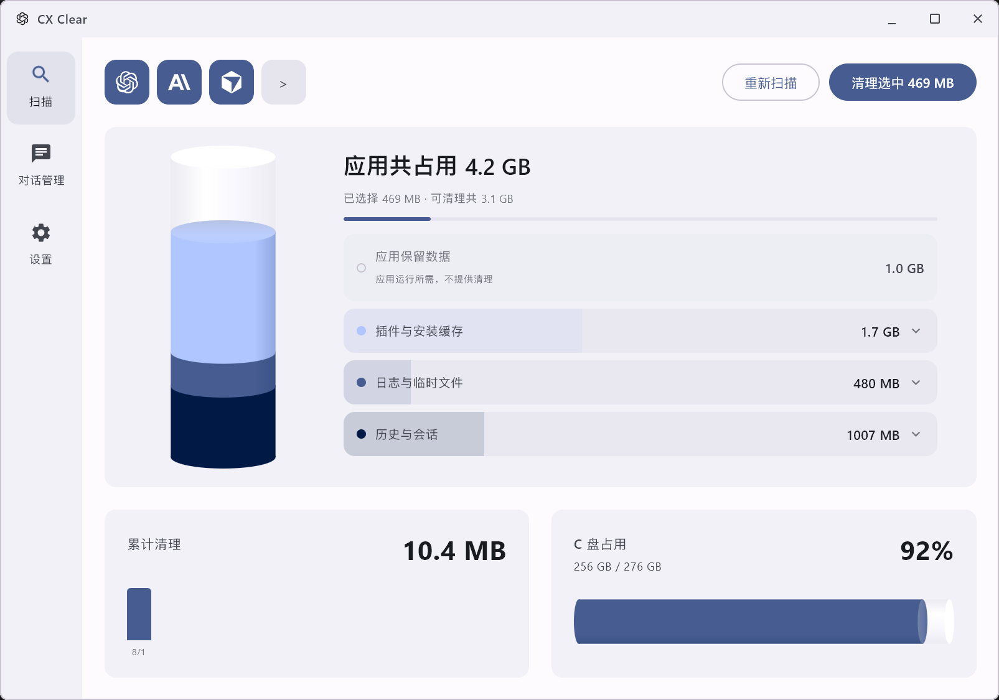
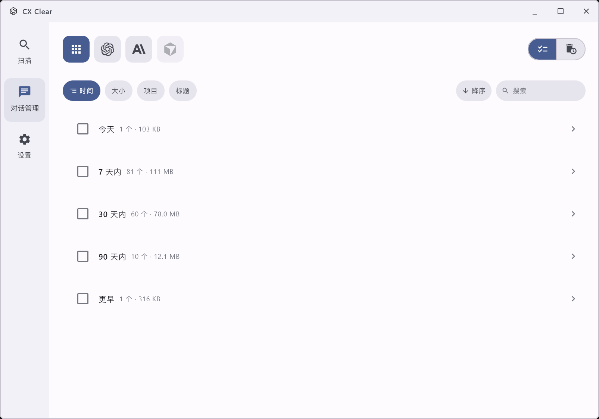
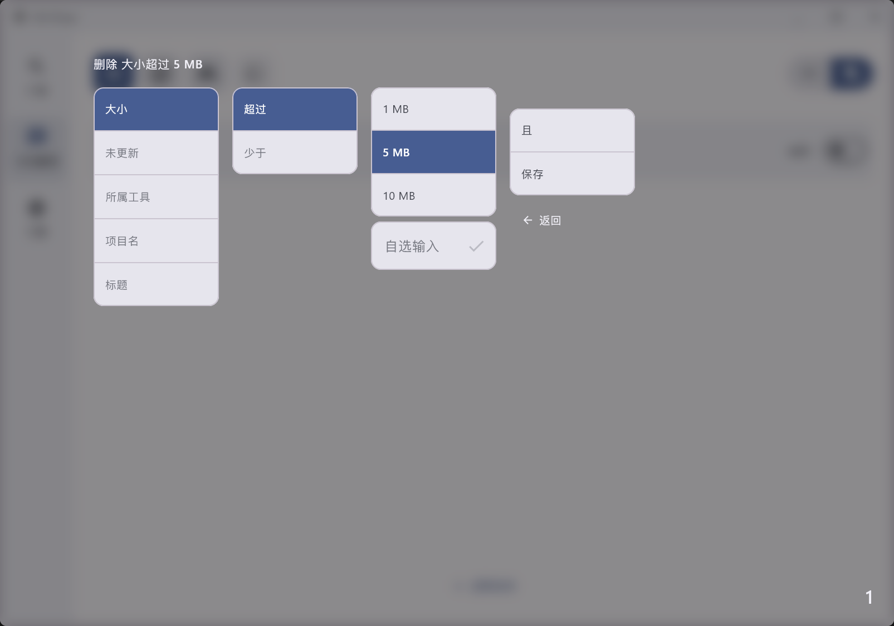

<div align="center">

  <h1>Cx Clear</h1>

  

  <br>
  <br>

  <b>简体中文</b>

  <a href="https://www.microsoft.com/windows">
    </a>
  <a href="https://kotlinlang.org/">
    </a>
  <a href="https://www.jetbrains.com/lp/compose-multiplatform/">
    </a>
  <a href="./LICENSE">
    </a>

  Cx Clear 是面向 AI 编程工具的本地缓存清理工具。支持 Codex、Claude Code、Cursor，采用 Kotlin 与 Compose for Desktop / Material 3 构建。

</div>

## 主要功能

- **多工具支持**：一键扫描 Codex、Claude Code、Cursor 的本地缓存与残留文件
- **风险分级**：
  - **SAFE**：可自动重建的缓存 / 临时文件，默认勾选（重建成本高的项除外）
  - **OPTIONAL**：会话历史、备份、扩展等，删后不可恢复，绝不默认勾选
- **安全优先**：
  - 目标工具仍在运行时整批阻断清理
  - 配置、登录态、用户规则等路径永久保护
  - 软链接不跟随；扫描后变更的文件不会被误删
  - 单个文件删失败会跳过并继续，不中断整次清理
- **实测进度**：清理进度按实际释放字节统计，而非扫描预估值
- **占用可视化**：扫描过程实时展示总占用与可清理体积，并保留近期清理历史
- **声明式名单**：新工具 / 新清理项优先只加配置，规则可审计、可扩展

## 软件截图

|                            扫描页                            |                           对话管理                            |                          自动清理策略                           |
|:---------------------------------------------------------:|:---------------------------------------------------------:|:---------------------------------------------------------:|
|  |  |  |

## 使用指南

### 安装包

从 [GitHub Releases](https://github.com/OWNER/cxclear/releases) 下载最新 Windows 安装包（MSI），安装后打开即可使用：

1. 选择要清理的工具（Codex / Claude Code / Cursor）
2. 点击「开始扫描」，查看总占用与可清理内容
3. 确认勾选项（注意 OPTIONAL 项），点击清理
4. 若提示工具仍在运行，请完全退出对应应用后重新扫描

### 从源码运行

环境要求：JDK 21+

```bash
# 直接运行
./gradlew run

# 打包 Windows MSI
./gradlew packageMsi

# 仅编译检查
./gradlew compileKotlin
```

## 清理范围说明

| 工具 | 数据根目录 | 不会清理 |
|------|-----------|---------|
| Codex | `~/.codex`、`~/.cache/codex-runtimes` | 认证、配置、会话主库、memories / rules / skills 等 |
| Claude Code | `~/.claude`、Local\\Claude-3p 等 | 配置、sessions、skills、插件数据等 |
| Cursor | `~/.cursor`、`%APPDATA%\\Cursor` | 安装目录、`state.vscdb`、settings / mcp / skills / agents、登录态等 |

更完整的名单维护约定见 [`doc/清理名单完善流程.md`](./doc/清理名单完善流程.md)。

## 贡献指南

欢迎各种形式的贡献：报告 Bug、补充清理名单、改进 UI，或提交代码。

(仅AI)补充 / 校正某个工具的清理项时，请先阅读 [`doc/清理名单完善流程.md`](./doc/清理名单完善流程.md)，优先只改 `profiles/Profiles.kt` 中的声明式数据。

## 贡献者

<a href="https://github.com/OWNER/cxclear/graphs/contributors">
  
</a>

Made with [contrib.rocks](https://contrib.rocks).

## Star History

<a href="https://www.star-history.com/#OWNER/cxclear&type=date&legend=top-left">
 <picture>
   <source media="(prefers-color-scheme: dark)" srcset="https://api.star-history.com/svg?repos=OWNER/cxclear&type=date&theme=dark&legend=top-left" />
   <source media="(prefers-color-scheme: light)" srcset="https://api.star-history.com/svg?repos=OWNER/cxclear&type=date&legend=top-left" />
   
 </picture>
</a>

## 开源协议

本项目以 [GNU General Public License v3.0](./LICENSE) 发布。

## 致谢

特别感谢所有的 [贡献者](https://github.com/OWNER/cxclear/graphs/contributors)，你们让项目变得更好。
