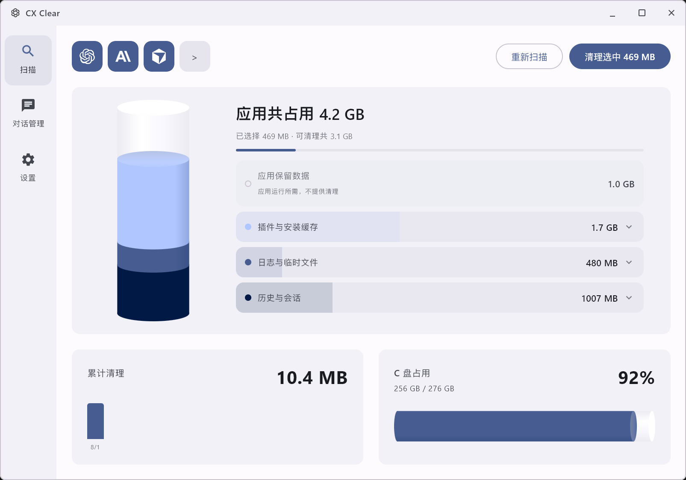
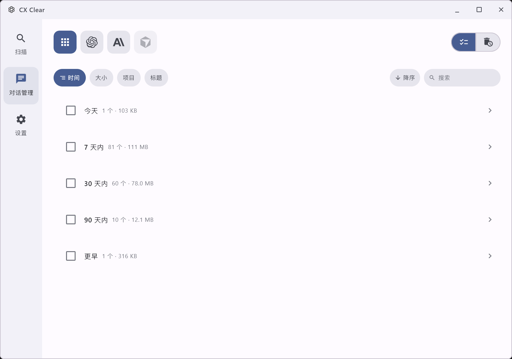
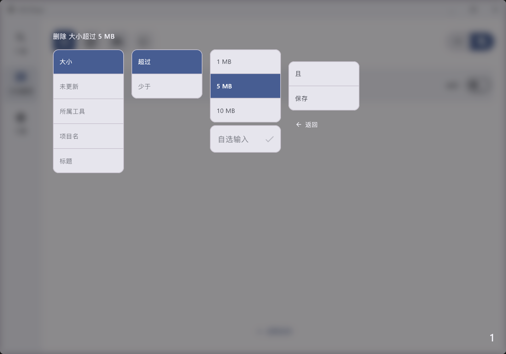

  <h1>Cx Clear</h1>

  

   
   

  <b>简体中文</b>

  
  
  
  

   

  清理 AI 编程工具的本地缓存和残留文件。Windows 桌面应用，也提供给 AI 调用的命令行。

   

  官网：[cx.xnncsj.xyz](https://cx.xnncsj.xyz)

## 设计理念

## 特色功能

- **美观GUI**：用户界面采用Material3主题，并且UI全部由真人设计，符合人类使用习惯
- **可扩展性强**：扁平化设计，单个应用的所有规则都放在一个文件夹内，可扩展性强
- **自动策略**：通过图形化编程创建自动策略，或者是直接让AI进行创建自动策略
- **命令行**：专为AI清理使用的命令行，提供多种筛选条件以及内置的规则，尽可能降低AI误删的风险（实验性功能，见 [wiki/CLI-Usage.md](wiki/CLI-Usage.md)）
## 软件截图

|                            扫描页                            |                           对话管理                            |                          自动清理策略                           |
|:---------------------------------------------------------:|:---------------------------------------------------------:|:---------------------------------------------------------:|
|  |  |  |

## 下载

从 [GitHub Releases](https://github.com/moumoum0/cx-clear/releases) 下载

## 贡献

目前需要 macOS 上的清理路径，以及更多软件的名单。补名单按照哦 [doc/清理名单完善流程.md](doc/清理名单完善流程.md) 

## 贡献者

Made with [contrib.rocks](https://contrib.rocks).

## Star History

<a href="https://www.star-history.com/#moumoum0/cx-clear&type=date&legend=top-left">
 <picture>
   <source media="(prefers-color-scheme: dark)" srcset="https://api.star-history.com/svg?repos=moumoum0/cx-clear&type=date&theme=dark&legend=top-left" />
   <source media="(prefers-color-scheme: light)" srcset="https://api.star-history.com/svg?repos=moumoum0/cx-clear&type=date&legend=top-left" />
   
 </picture>
</a>

## 开源协议

本项目以 [GNU General Public License v3.0](./LICENSE) 发布。

## 致谢

特别感谢所有的 [贡献者](https://github.com/moumoum0/cx-clear/graphs/contributors)，你们让项目变得更好。
